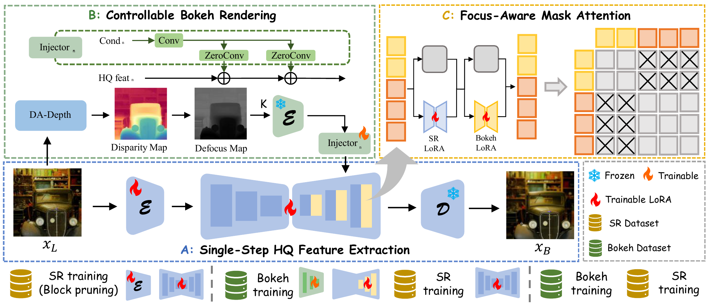

<!-- # MagicBokeh -->
<div align=center>

</div>

<h1 align="center">[CVPR 2026 Oral] Towards Photorealistic and Efficient Bokeh Rendering via Diffusion Framework</h1>
<div align="center">

<h4>

<a href="https://arxiv.org/abs/2605.07429v1">📄 arXiv Paper</a> &nbsp; 
<a href="https://github.com/vivoCameraResearch/MagicBokeh">🌐 Project Page</a> &nbsp; 
<a href="https://huggingface.co/LinxiaoShi/Magicbokeh">🤗 Hugging Face Models</a>
</h4>

</div>

<div align="center">

</div>

<div align="center">
<strong><i>MagicBokeh</i> is the first unified method specifically designed for high-zoom bokeh rendering.</strong>
</div>

## 📖 Overview
### Abstract

Existing mobile devices are constrained by compact optical designs, such as small apertures, which make it difficult to produce natural, optically realistic bokeh effects. Although recent learning-based methods have shown promising results, they still struggle with photos captured under high digital zoom levels, which often suffer from reduced resolution and loss of fine details. A naive solution is to enhance image quality before applying bokeh rendering, yet this two-stage pipeline reduces efficiency and introduces unnecessary error accumulation. To overcome these limitations, we propose MagicBokeh, a unified diffusion-based framework designed for high-quality and efficient bokeh rendering. Through an alternative training strategy and a focus-aware masked attention mechanism, our method jointly optimizes bokeh rendering and super-resolution, substantially improving both controllability and visual fidelity. Furthermore, we introduce degradation-aware depth module to enable more accurate depth estimation from low-quality inputs. Experimental results demonstrate that MagicBokeh efficiently produces photorealistic bokeh effects, particularly on real-world low-resolution images, paving the way for future advancements in bokeh rendering.

### Architecture

<div align="center">
  
</div><br/>


## 🛠️ Environment Setup

The code is developed using **Python 3.10** and **PyTorch**.

```bash
# Create and activate environment
conda create -n magicbokeh python=3.10
conda activate magicbokeh

# Install dependencies
pip install torch==2.3.0 torchvision==0.18.0 torchaudio==2.3.0
pip install -r requirements.txt
```

## 🚀 Test
### 1. Data Preprocessing
Before bokeh rendering, you should runs [Depth-Anything-V2](https://github.com/DepthAnything/Depth-Anything-V2) or our [DA depth](https://huggingface.co/LinxiaoShi/Magicbokeh) and [LDF](https://github.com/weijun-arc/LDF) to produce depth maps and salient-object masks for your input images.

```bash
# Prepare data
python prepare_data.py \
    --input_dir "./test_data/inputs" \
    --depth_dir "./test_data/depth" \
    --mask_dir "./test_data/mask" \
    --resnet_path "path/to/resnet50-19c8e357.pth" \
    --model_path "path/to/model-40" \
    --depth_ckpt "path/to/depth_model/DAdepth.pth"
```

### 2. Inference
This command runs inference on a set of input images using the trained model.

```bash
# Inference
python inference.py \
    --input_dir "./test_data/inputs" \
    --depth_dir "./test_data/depth" \
    --mask_dir "./test_data/mask" \
    --output_dir "./test_data/output" \
    --K 32 \
    --pretrained_model_name_or_path "$SD_DIR" \
    --model_path "$CKPT_DIR"
```
#### Arguments:
 * --K : Control the strength of the Bokeh effect.

## 🎨 Quick Start (Demo)
If the LDF model fails to correctly select the target object, you can manually click on the image to quickly test our model on your own images using the provided demo script.

```bash
# Basic demo
python demo.py \
    --pretrained_model_name_or_path "$SD_DIR" \
    --model_path "$CKPT_DIR" \
    --depth_model_path "$DADEPTH_DIR"
```


## 🙏 Acknowledgements

This project is built upon the following excellent open-source repositories:

* [OSEDiff](https://github.com/cswry/OSEDiff): The base generative backbone for our framework.
* [LDF](https://github.com/weijun-arc/LDF): For generating accurate salient object masks.
* [Depth anything v2](https://huggingface.co/depth-anything/Depth-Anything-V2-Large): The base model for our degradation-aware depth module.
* [Stability AI](https://github.com/Stability-AI/generative-models): For the foundational SD2.1 model.
* [diffusers](https://github.com/huggingface/diffusers): For the powerful and flexible diffusion model training and inference suite.

We thank the authors of these projects for their great work and for making their code available to the community, which has significantly facilitated our research.


## 📜 Citation

If you find our work or code useful for your research, please cite:

```latex
@misc{shi2026photorealisticefficientbokehrendering,
      title={Towards Photorealistic and Efficient Bokeh Rendering via Diffusion Framework}, 
      author={Linxiao Shi and Siming Zheng and Zerong Wang and Hao Zhang and Jinwei Chen and Bo Li and Shifeng Chen and Peng-Tao Jiang},
      year={2026},
      eprint={2605.07429},
      archivePrefix={arXiv},
      primaryClass={cs.CV},
      url={https://arxiv.org/abs/2605.07429}, 
}

```